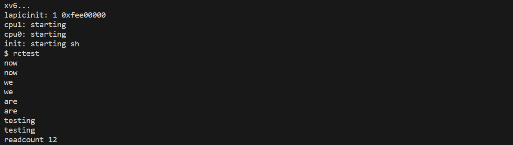
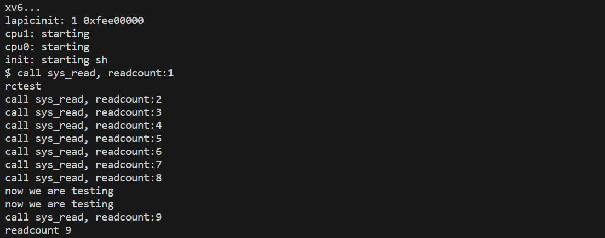
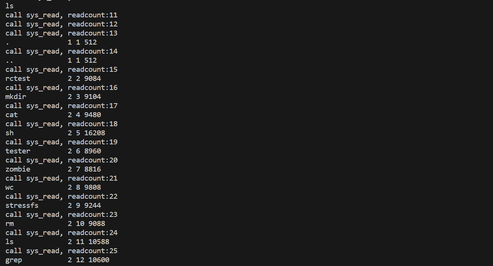

[](https://classroom.github.com/a/m0y0-Z8u)
# xv6 System Call






##### System Call: getreadcount

```c
int getreadcount(void)
```

该系统调用返回一个计数器的值，每次当有用户进程调用read()系统调用时，该计数器的值都会递增。

思路：跟踪一个系统调用的执行过程，并模仿它的行为。

###### Getting Into The Kernel

`user/usys.S`

```assembly
#define SYSCALL(name) \
  .globl name; \
  name: \
    movl $SYS_ ## name, %eax; \ 
    int $T_SYSCALL; \ 
    ret
```

当用户程序进行系统调用时，需要将对应的调用编号放入寄存器中，并发出trap指令陷入内核

- `%eax`：存放系统调用编号
- `T_SYSCALL`：说明trap的类型为系统调用

> 传递给系统调用的任何参数都将在`trapframe`中传递

`usys.S`文件包含两个头文件

- `include/syscall.h`：定义系统调用编号，我们**在这里添加新的系统调用编号**

  ```c
  // System call numbers
  ......
  #define SYS_getpid 18
  ......
  #define SYS_getreadcount 22
  ```

- `include/traps.h`：定义trap类型编号

  ```c
  #define T_SYSCALL       64      // system call
  ```

在`usys.S`中我们**添加新的系统调用函数声明**

```assembly
......
SYSCALL(getpid)
......
SYSCALL(getreadcount)
```

###### Trap Table

`int`指令执行之后，硬件就会接管执行系统调用的工作。

- 首先，将CPU权限提升到内核态

  > CPL 3(用户态)->CPL 0(内核态)

- 然后，将控制权转移到系统的`trap vectors`上

  > 操作系统在启动时告知硬件在发生特定trap时应运行代码的位置

`kernel/trap.c`中的`SETGATE`用于设置idt数组，以在各种trap和interrupt发生时指向正确的执行代码。

```c
SETGATE(idt[T_SYSCALL], 1, SEG_KCODE<<3, vectors[T_SYSCALL], DPL_USER);
```

这里填充了`idt`数据结构，实际的硬件通知发生在启动序列的稍后阶段。

`main.c`中的`mpmain()`调用`trap.c`中的`idtinit`，`idtinit`调用`x86.h`中的`lidt`

> `lidt`将中断描述符表的地址和大小加载到处理器的中断描述符表寄存器中，以便在发生中断时，处理器能够根据中断向量号找到对应的中断处理程序

###### From Low-level To The C Trap Handler

当用户程序通过`int`指令发出系统调用时，OS已经设置好了trap处理程序。在执行任何代码之前，硬件需要将一些必要的寄存器（在`x86.h`中的`trapframe`中定义）保存到堆栈中。部分`trapframe`由硬件填充，其余由操作系统保存。

OS运行的第一个代码是`kernel/vectors.S`中的`vector64`

```assembly
.globl vector64
vector64:
  pushl $64
  jmp alltraps
```

将trap编号压栈(`trapframe`中的`trapno`)，调用`alltrap`将寄存器状态保存到`trapframe`中(参数在次传递)。

然后操作系统系统更改某些描述符和寄存器的值，以便访问内核内存。最后调用trap处理程序。

###### The C Trap Handler

设置好`trapframe`之后，底层汇编调用`trap()`，并传递一个指向`trapframe`的指针。

`kernel/trap.c`

```c
void
trap(struct trapframe *tf)
{
  if(tf->trapno == T_SYSCALL){
    if(cp->killed)
      exit();
    cp->tf = tf;
    syscall();
    if(cp->killed)
      exit();
    return;
  }
  ... // continues
}  
```

检查编号与进程状态，然后调用`syscall()`来实际执行系统调用。

在`syscall.c`中定义了一个`syscalls`数组，数组元素是函数指针，用于处理系统调用。每个系统调用都与一个特定的处理函数相关联。

`kernel/syscall.c`：我们**在这里可以添加新的系统调用处理函数**

```c
// array of function pointers to handlers for all the syscalls
static int (*syscalls[])(void) = {
......
[SYS_getpid]  sys_getpid,
......
[SYS_getreadcount] sys_getreadcount,
};

void
syscall(void)
{
  int num;
  num = proc->tf->eax;
  if(num > 0 && num < NELEM(syscalls) && syscalls[num] != NULL) {
    proc->tf->eax = syscalls[num]();
  } else {
    cprintf("%d %s: unknown sys call %d\n",
            proc->pid, proc->name, num);
    proc->tf->eax = -1;
  }
}
```

`include/syscall.h`

```c
// System call numbers
......
#define SYS_getpid 18
......
#define SYS_getreadcount 22
```

从前文可知，系统调用编号已经通过寄存器`%eax`传递给我们，现在我们从`trapframe`中加载该编号，根据编号调用`syscalls`中定义的对应的处理函数。返回值被存储在`%eax`中，以便传回给用户。

**开始添加getreadcount的系统调用处理函数**

`kernel/sysfunc.h`

```c
// System call handlers
......
int sys_getpid(void);
......
int sys_getreadcount(void);
```

找到定义`sys_read()`的文件`sysfile.c`

添加全局变量`readcount`，记录`read()`的调用次数

`kernel/sysfile.c`

```c
static int readcount=0;

int
sys_read(void)
{
  readcount++;
  // cprintf("call sys_read, readcount:%d\n",readcount);
  struct file *f;
  int n;
  char *p;

  if(argfd(0, 0, &f) < 0 || argint(2, &n) < 0 || argptr(1, &p, n) < 0)
    return -1;
  return fileread(f, p, n);
}

int
sys_getreadcount(void){
  return readcount;
}
```

###### The Return Path

返回时将相关值从堆栈中弹出，以恢复运行进程的上下文。

`iret`：trap返回指令，类似函数调用返回，同时将权限将为用户级别，并跳转回`usys.S`中的`int`指令之后，然后`ret`指令返回到用户程序。

###### Test

编写测试

`user/rctest.c`

```c
#include "types.h"
#include "user.h"
char buf[512];
int main(){
    int n;
    while(n=read(0,buf,sizeof(buf))){
        write(1, buf, n);
    }
    int readcount=getreadcount();
    printf(1, "readcount %d\n", readcount);
}
```

`user/user.h`：添加函数声明

```c
#ifndef _USER_H_
#define _USER_H_

struct stat;

// system calls
int getreadcount(void);
#endif // _USER_H_
```

`user/makefile.mk`：将`rctest`加入用户程序列表，实现编译链接

```makefile
# user programs
USER_PROGS := \
	cat\
	echo\
	forktest\
	grep\
	init\
	kill\
	ln\
	ls\
	mkdir\
	rm\
	sh\
	stressfs\
	tester\
	usertests\
	wc\
	zombie\
	rctest
```


